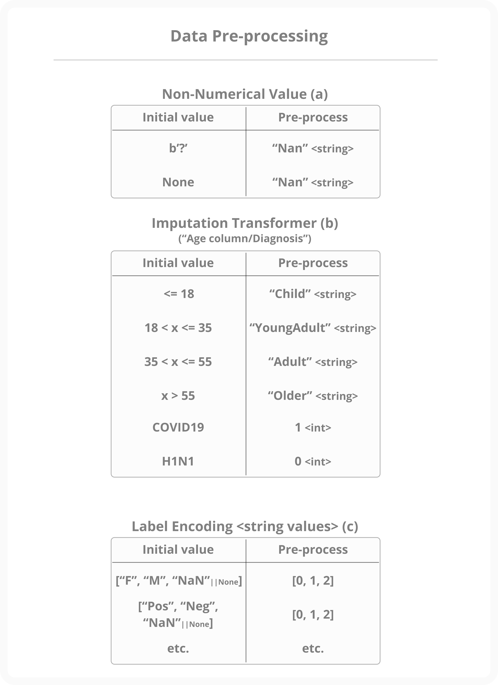
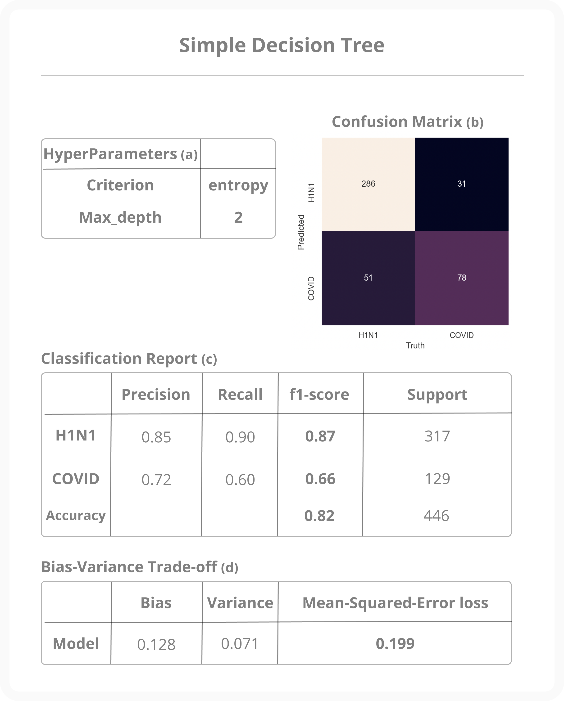
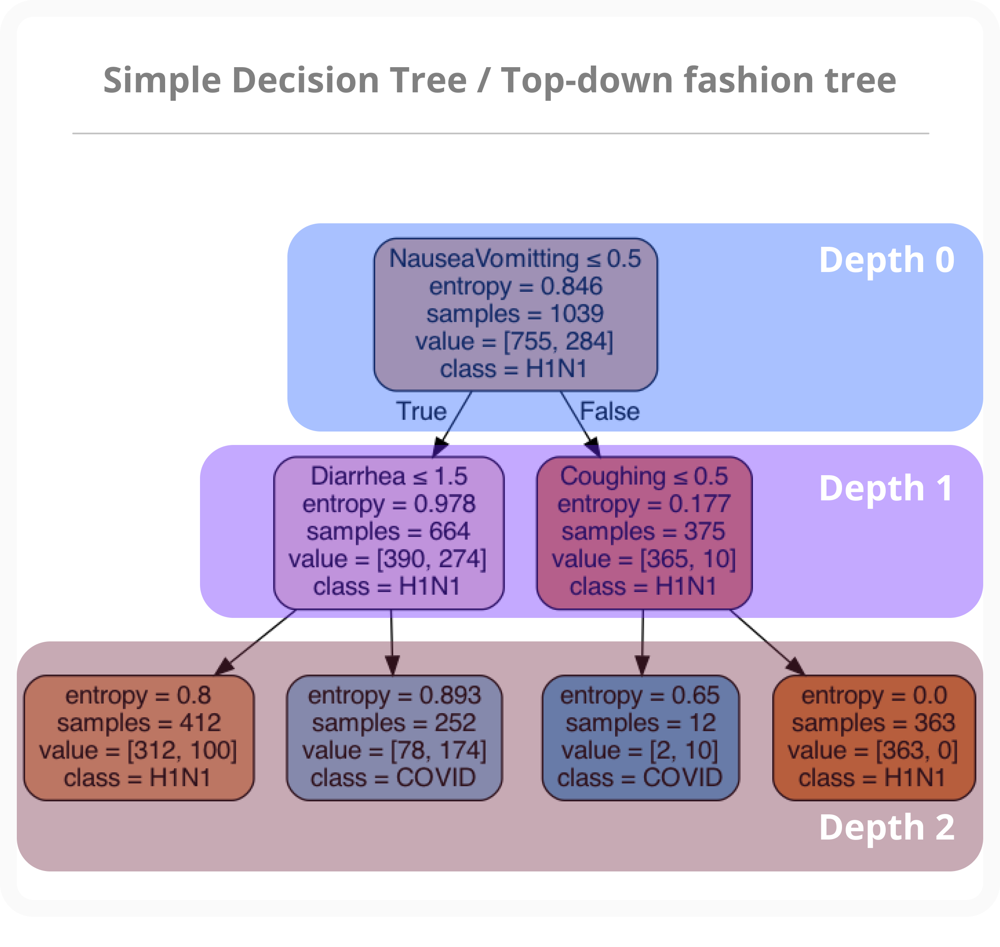
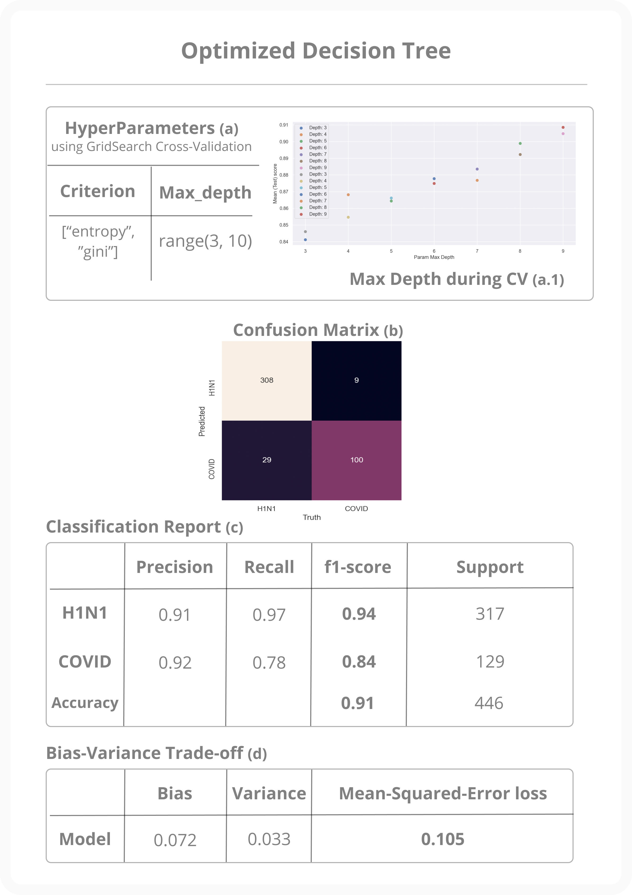
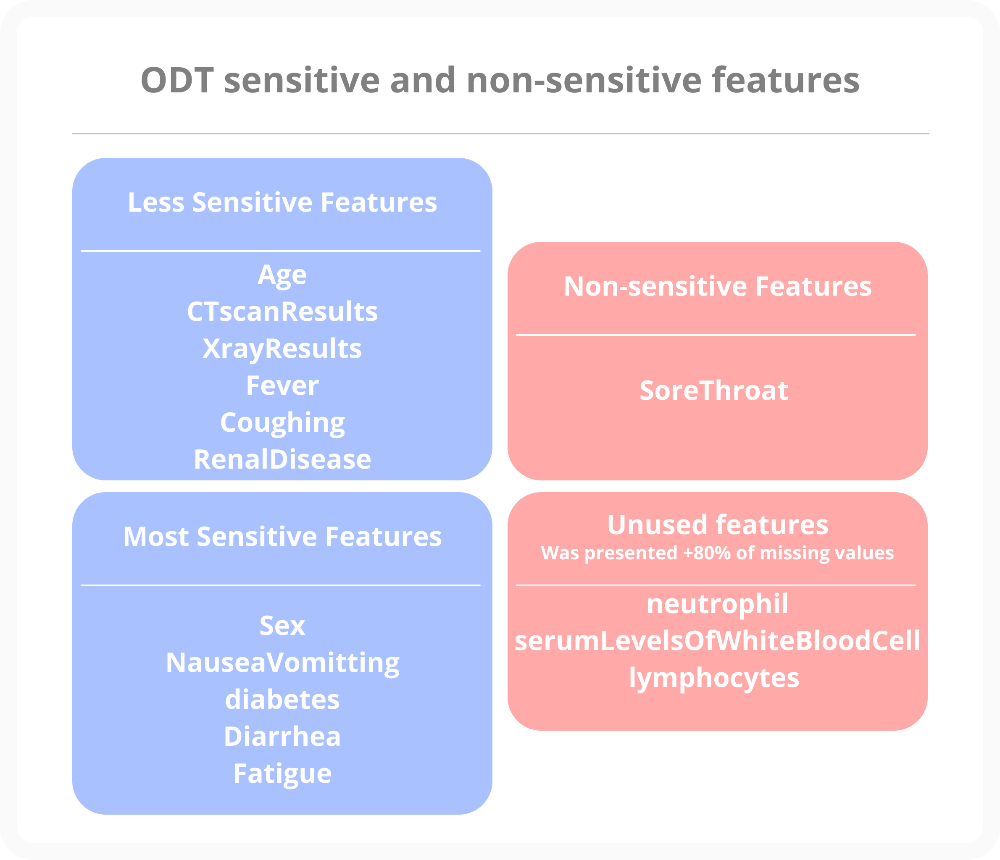
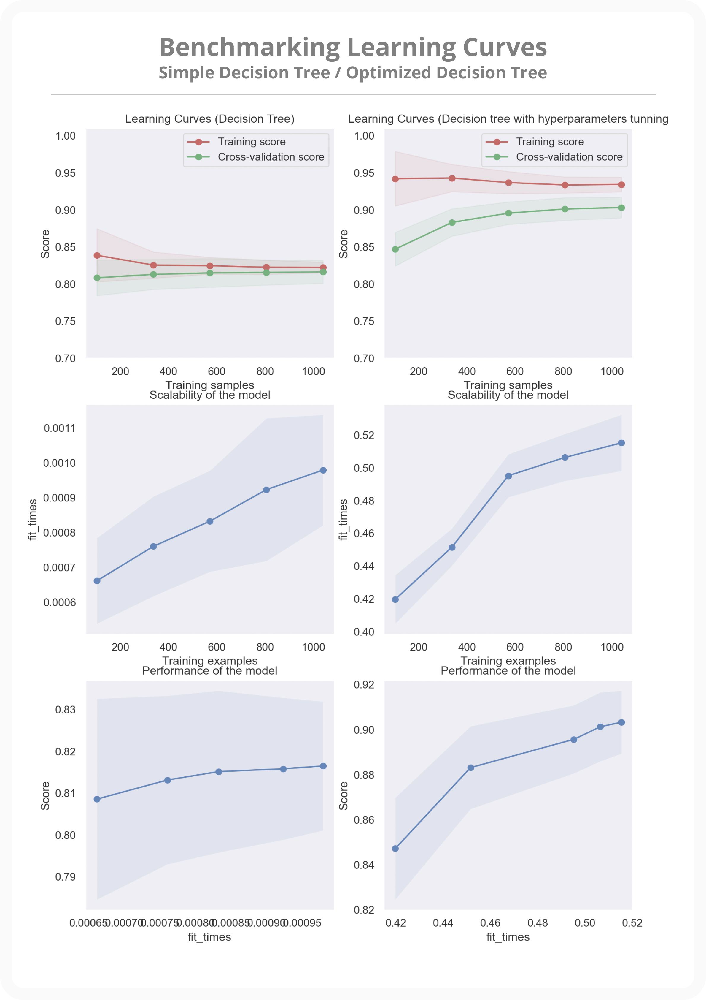
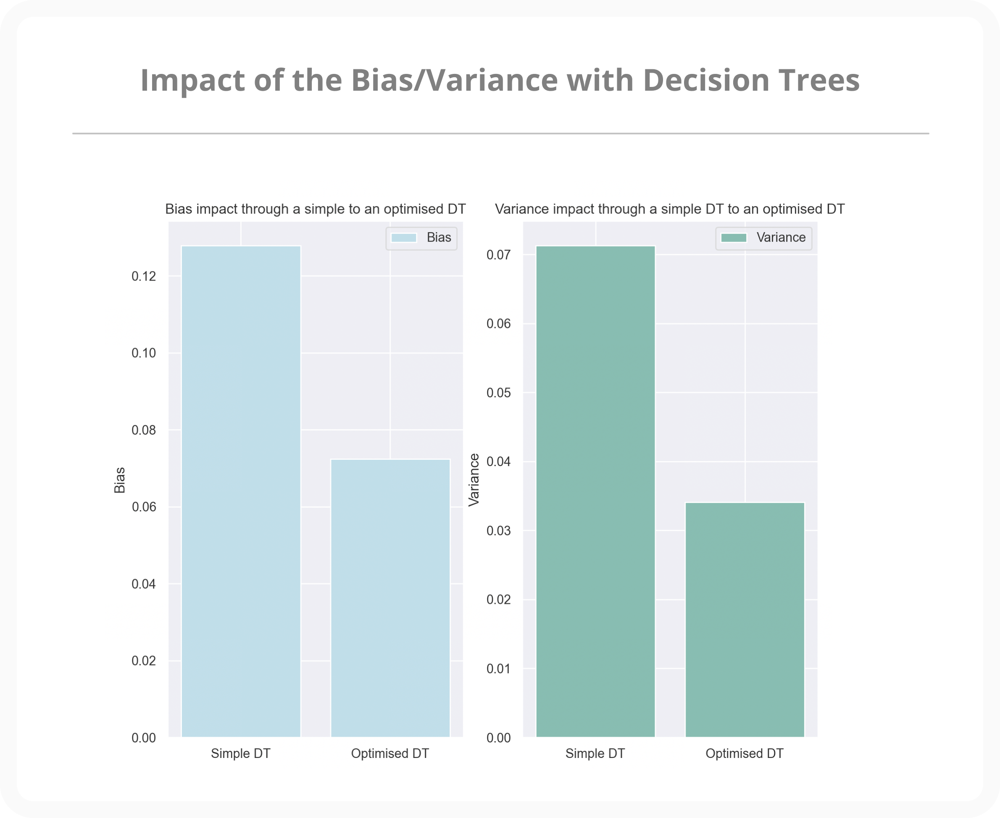
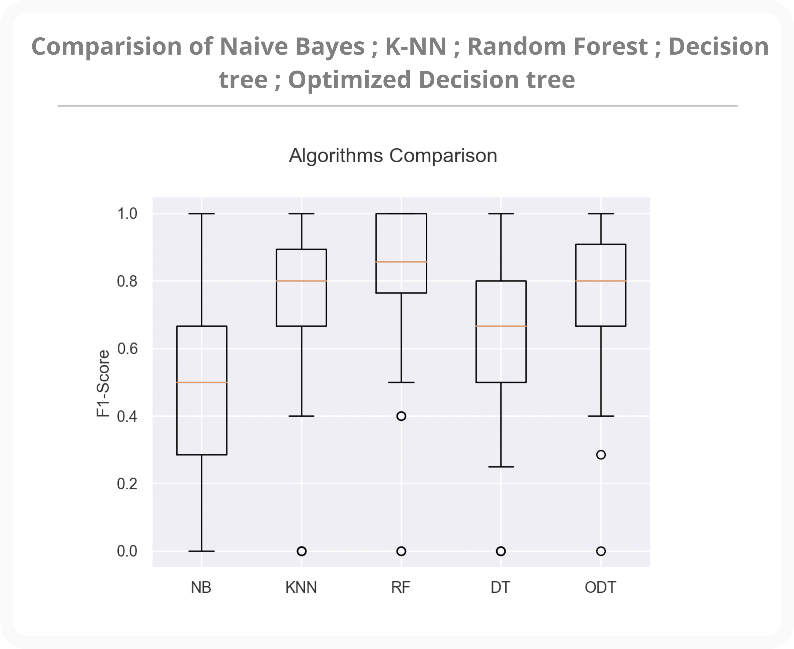

# Machine Learning Classifier for COVID-19 & FLU Data

The goal of this project is to demonstrate an implementation of an optimised decision tree capable of classifying the
data fed to it with ~90% accuracy using Python and the Scikit Learn as Machine Learning Library. More information can
be found in the sections that follow.

[Python](http://python.org)

[Scikit Learn](http://scikit-learn.org)

## How to run the project 🏃🏻‍♂️

First and foremost, ensure that all the required packages are installed (see `requirement.txt`), otherwise, use the script
`packages-required-install.sh` to have them installed in your Python packages env.

- `python(3) main.py` (It reads the `data.csv` file at the project's root automatically).

## Documentation 📖

The project is fully commented and accessible through a pre-compiled version at the project's root folder named: `/pre-compiled-documentation`.

Make sure you have the python package `pdoc` installed before regenerating the documentation.

- `./documentation.sh` and see the output.

## Code source and contribution 👀

The project is open and free to use, however, feel free to add some scenarios to the main file `main.py` and submit a
[pull-request](https://github.com/simonprovost/Machine-Learning-COVID19andFLUE/pulls). I would be happy to make that short study of the data more flourished with your ML experience.

# Quick report of the study

## Data 🤝

The data are provided from the recent research article of Li, W.T _et.al_ [1] on `Using machine learning of clinical data to diagnose COVID-19: a systematic review and meta-analysis`.

[1].`
Li, W.T., Ma, J., Shende, N., Castaneda, G., Chakladar, J., Tsai, J.C., Apostol, L., Honda, C.O., Xu, J., Wong, L.M. and Zhang, T., 2020. Using machine learning of clinical data to diagnose COVID-19: a systematic review and meta-analysis. BMC medical informatics and decision making, 20(1), pp.1-13.
`

## Pre-Processing 🔬

The dataset provided was also derived from previously published works on the internet, and it contained a
significant number of missing values or categorical features. For the well-processing of the classifiers
shown below (Fig: 1), the Label encoding and Hand-impute methods were used.

Fig: 1 - Pre-processing of the data.

## Simple Decision-tree

To begin, a first decision tree was created in order to observe the behaviour of its output in relation to the
data that was fed into it. The outcome was disappointing because the tree's depth was too shallow, implying that the
model is not even slightly correlated with the training data.  All the classifier's parameters, as well as the
outcome metrics (Conf. Matrix, Classifier reports, and so on), are shown below (Fig: 2).
The representation of the output tree is shown below (Fig: 3).

Fig: 2 - Simple decision tree outcomes

Fig: 3 - Simple decision tree representation.

## Optmised Decision-tree

After the poor results shown above, a more in-depth analysis of the hyperparameters has been performed using a
K-cross-validation method. Having the highest score, on the other hand, increases the risk of getting an over-fitted model.
To avoid a model that is overly correlated with the training dataset, hyperparameter range has been intentionally
hand-decreased (range(x, 21) -> range(x, 10)), illustrated in (Fig: 4). The exhibit model is effective while also
being easily interpretable: _best depth found was 9 with gini for the impurity method.
There is less miss-classification and showed strong results with the harmonic mean of precision/recall (Fig: 4).
Finally, the sensitive features observed are shown below (Fig: 5).

The tree representation is available [here](https://github.com/simonprovost/Machine-Learning-COVID19andFLUE/blob/main/assets/Optimised-decision-tree.png).

Fig: 4 - Optimised decision tree outcomes with hyper parameters tuning using Cross-validation.

Fig: 5 - Optimised decision tree sensitive features.

## Benchmarking Learning curves Simple/Optimised Decision-tree / Bias-variance trade-off 🧪

Regarding the Scikit Learn Classification report or the confusion matrix available above, it was difficult to determine
which model had a better fit of the data (i.e.:not under/over but good fit). The figure below describes how good the model is
with the training and cross-validated datasets in the first row. The simple decision tree appears to be very close with
both curves but has a low accuracy, whereas the optimised decision tree on the right has a slight over fit but a high accuracy, which
is not too bad in the current context because it can be applied to unseen data and still recovers good prediction.
The missing values in the data appear to be the source of the overfitting in this case. The two last rows are about
the performance regarding the time of the training etc which presents a huge gap between the simple DT and the 
optimised DT with cross-validation. (Fig: 6). On the other hand, the bias and variance of each model presents
a huge gap after having performing cross-validation for hyper parameters tuning. (Fig: 7).

Fig: 6 - Simple/Optimised DT learning curves

Fig: 7 - Impact bias variance trade off from the Simple to the Optimised decision tree

## Classifiers comparison 📊

Other classifiers are available throughout the Scikit Learn library, and there are likely other ways to manage that
data as well. Following the completion of the preceding experiments, a final one on the comparison of several classifiers
was carried out. According to the findings, the Random Forest classifier is extremely powerful, but it is clearly less
interpretable than a simple decision tree with hyper parameters tuning (using cross-validation). Personally,
I would use the optimised decision tree because of its interpretability and high accuracy. Results are shown below (Fig: 8).

Fig: 8 - Simple/Optimised DT learning curves

## Limitation and further study 🚨

Some subjects within the data are outliers, as one may have tested positive for one or another disease without mentioning any
symptoms (only age and sex). Hence, more research on outliers could reduce the number of miss-classifications or
better-fit the slightly over-fitted model.

